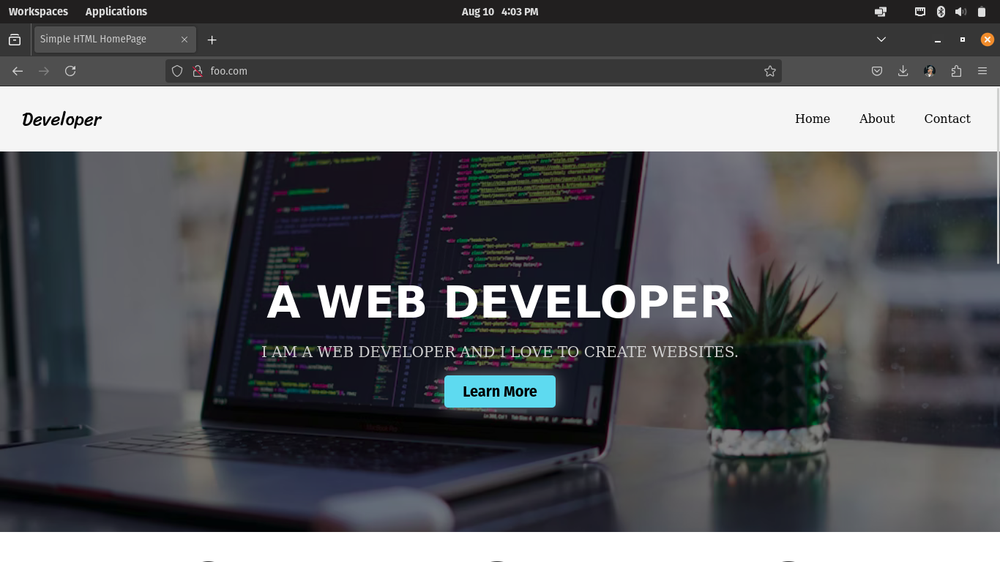
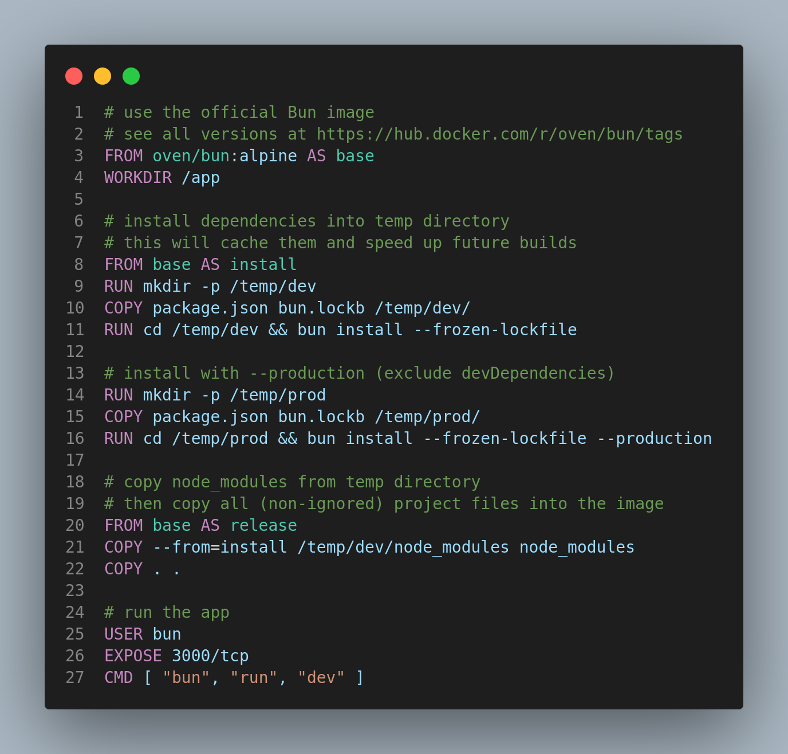
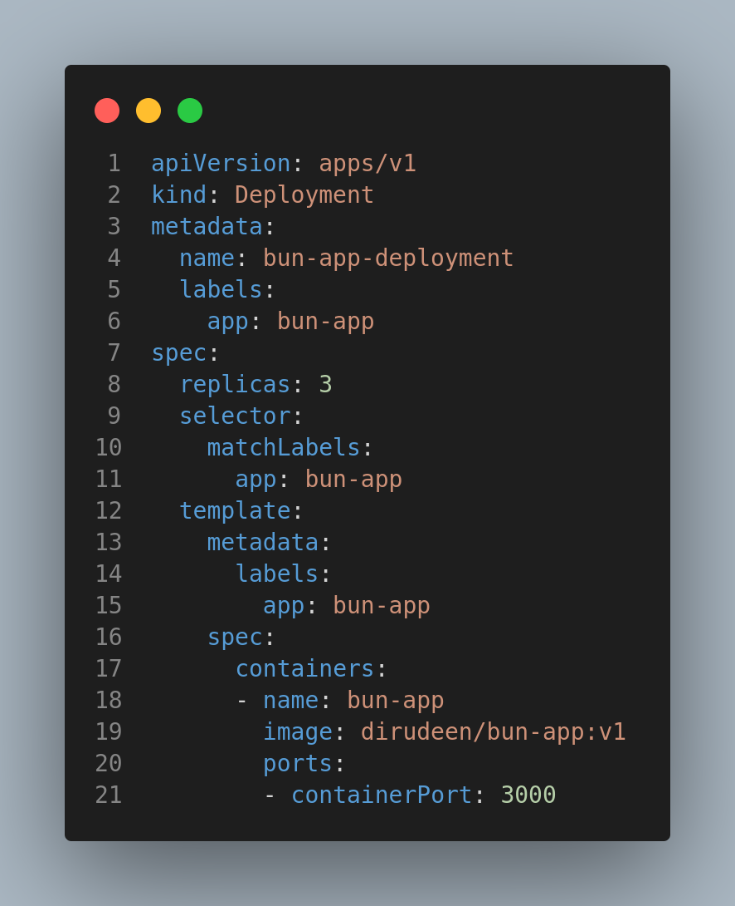
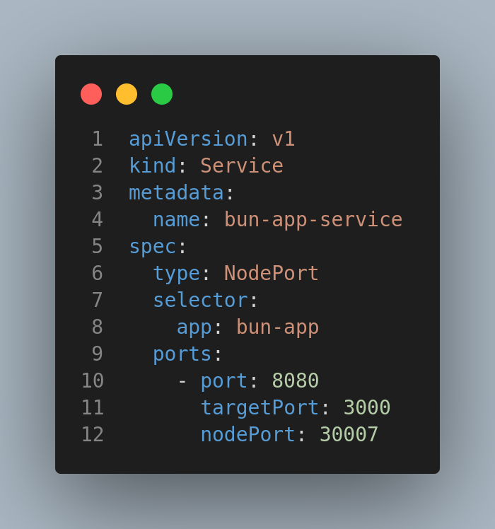
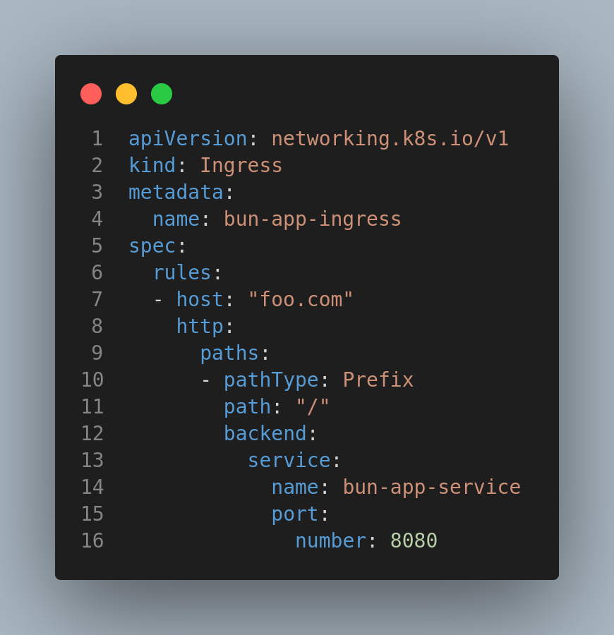

# Bun Application Deployed on Minikube Kubernetes
## Overview

This document outlines the steps to deploy a Bun application, which serves a simple portfolio website, on a Minikube Kubernetes cluster. The deployment involves using a Docker image, along with deployment.yml, service.yml, and ingress.yml files. The deployment.yml file is used to provision 3 replicas of the application, ensuring high availability.

### 1. Building and Pushing Docker Image

Before deploying the application, you need to build the Docker image using the Dockerfile and push it to Docker Hub.
    

### 2. Deployment Configuration

The deployment.yml file is used to define the Kubernetes Deployment. This file sets up 3 replicas of your application to ensure high availability.

### 3. Service Configuration

Using the Service resource of type NodePort, you can access the application using the node's IP address.

### 4. Ingress Configuration

An Ingress resource is created to expose the application to the outside world. By installing the Nginx-Ingress Controller addon for Minikube, you can create a host domain and add it to /etc/hosts to simulate a real-world scenario.

### 5. Network Traffic Analysis

Finally, Kubeshark is installed to analyze network traffic within the Minikube cluster. You can monitor Kubeshark while sending multiple requests to the host domain (e.g., foo.com) to observe how the Nginx load balancer distributes traffic in real-time.

