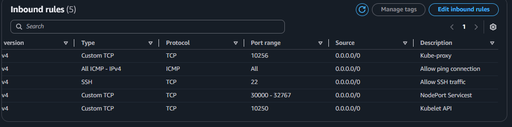
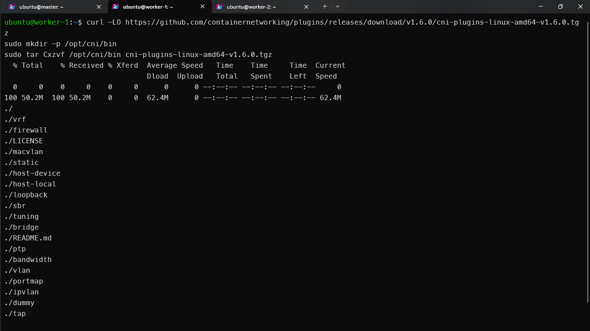
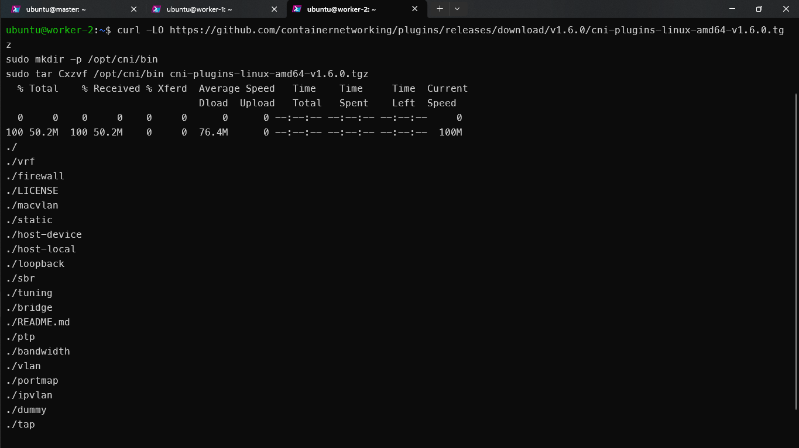

# Installing Kubernetes using Kubeadm utility
This guide covers the step-by-step process of installing Kubernetes using the `kubeadm` utility. `kubeadm` is a tool recommended for bootstrapping a Kubernetes cluster. We will use 3 nodes: a master node and 2 worker nodes. The nodes will run on AWS EC2 instances with Ubuntu 20.04 LTS (t2.medium instance type, 8GB storage). You can use any cloud provider to launch the instances.

## Prerequisites

#### Infrastructure Requirements:
- Instance Type: t2.medium or better.
- Storage: 8GB minimum.
- Operating System: Ubuntu 20.04 LTS.
- Network: Ensure all nodes are in the same VPC with required ports opened.

#### Tools:
-  SSH client (e.g., ssh or PuTTY).
-  curl, vi or nano (pre-installed in Ubuntu).

#### Required Ports: (Ensure these are allowed in the security group)
This ports are required for the Kubernetes cluster to work. Check the [Kubernetes documentation](https://kubernetes.io/docs/setup/production-environment/tools/kubeadm/create-cluster-kubeadm/#check-required-ports) for more information.

##### Master Node:
-  TCP: 6443 (Kubernetes API Server)
-  TCP: 2379-2380 (Etcd)
-  TCP: 10250 (Kube Scheduler)
-  TCP: 10257 (Kube Controller Manager)
-  TCP: 10250 (Kubelet API)
-  TCP: 22 (SSH)
-  ICMP: (Ping Connection)
    


##### Worker Nodes:
-  TCP: 10256 (Kube Proxy)
-  TCP: 30000-32767 (NodePort Services)
-  TCP: 10250 (Kubelet API)
-  TCP: 22 (SSH)
-  ICMP: (Ping Connection)




## Step-by-Step Setup
### 1. Launch EC2 Instances
-  Configuration:
    -  Instance Type: t2.medium
    -  AMI: Ubuntu 20.04 LTS
    -  Storage: 8GB
    -  Key Pair: Create or use an existing one.
    -  Assign Public IP: Yes.

-  Result: Master and Worker Nodes


### 2. Connect to Instances and Set Hostnames
Setting a hostname ensures each node has a unique identifier, simplifying management and troubleshooting.

#### Master Node

```bash
ssh -i "key-pair-name.pem" ubuntu@master-node-ip
hostnamectl set-hostname master
```


### Worker Nodes (worker-1, worker-2)
```bash
ssh -i "key-pair-name.pem" ubuntu@worker-node-ip
hostnamectl set-hostname worker-[1-2]
```
 


### 3. Test Node Connectivity

Verifies that the nodes can communicate with each other, which is essential for Kubernetes components to function correctly.

#### From Master Node
```bash
ping worker-1-ip
ping worker-2-ip
```


### 4. Disable Swap memory on all nodes
Kubernetes requires swap to be disabled to ensure proper memory allocation for containers.

#### Temporary (until reboot)
```bash
sudo swapoff -a
```
#### Permanent
```bash
sudo sed -i.bak '/ swap / s/^/#/' /etc/fstab
```

  


### 5. Enable Overlay and Bridge Filtering Modules
These kernel modules enable container network communication and ensure traffic routing works properly within the cluster. These settings allow the Kubernetes networking model to function correctly by enabling packet forwarding and bridge filtering.

```bash
cat <<EOF | sudo tee /etc/modules-load.d/k8s.conf
overlay
br_netfilter
EOF
sudo modprobe overlay
sudo modprobe br_netfilter
# sysctl params required by setup, params persist across reboots
cat <<EOF | sudo tee /etc/sysctl.d/k8s.conf
net.bridge.bridge-nf-call-iptables  = 1
net.bridge.bridge-nf-call-ip6tables = 1
net.ipv4.ip_forward                 = 1
EOF
```


#### Apply sysctl params without reboot
```bash
sudo sysctl --system
```


#### Verify br_netfilter and overlay modules are loaded
```bash
lsmod | grep br_netfilter
lsmod | grep overlay
# Verify that the net.bridge.bridge-nf-call-iptables, net.bridge.bridge-nf-call-ip6tables, and net.ipv4.ip_forward system variables are set to 1 in your sysctl config by running the following command:
sysctl net.bridge.bridge-nf-call-iptables net.bridge.bridge-nf-call-ip6tables net.ipv4.ip_forward
```


### 6. Install Container Runtime (Containerd)
Downloads and extracts containerd, which is a lightweight and efficient container runtime for Kubernetes.
```bash
curl -LO https://github.com/containerd/containerd/releases/download/v2.0.0/containerd-2.0.0-linux-amd64.tar.gz
sudo tar Cxzvf /usr/local containerd-2.0.0-linux-amd64.tar.gz
```
  


#### Install containerd service file and generate default configurations
Donwloads and installs the containerd service file, which is responsible for managing the containerd runtime and generates a default configuration file for containerd.
```bash
curl -LO https://raw.githubusercontent.com/containerd/containerd/main/containerd.service
sudo mkdir -p /usr/local/lib/systemd/system/
sudo mv containerd.service /usr/local/lib/systemd/system/
sudo mkdir -p /etc/containerd
containerd config default | sudo tee /etc/containerd/config.toml
```
  

#### Set `SystemdCgroup` to true in runc.options
This configuration change enables the use of systemd cgroups for managing the resources and lifecycle of containers in the containerd runtime, which can potentially improve performance and reliability.

1. Open the `/etc/containerd/ config.toml` file using the `vi` text editor:
```bash
sudo vi /etc/containerd/config.toml
```

2. Navigate to the `plugins.'io.containerd.cri.v1.runtime'.containerd.runtimes.runc.options` section of the configuration file.

3. Add the following line to this section:
`plugins.'io.containerd.cri.v1.runtime'.containerd.runtimes.runc.options`

```bash
SystemdCgroup = true
```


#### Reload Systemd Daemon and Enable Containerd Service
Reloads systemd to recognize the containerd service and enables it to start automatically.
```bash
sudo systemctl daemon-reload
sudo systemctl enable --now containerd
sudo systemctl status containerd.service
```
  


#### Install Runc Runtime
Downloads and installs the runc runtime, which is a lightweight and efficient container runtime for Kubernetes. Runc is required by containerd to manage and run containers based on OCI specifications.

```bash
curl -LO https://github.com/opencontainers/runc/releases/download/v1.2.2/runc.amd64
sudo install -m 755 runc.amd64 /usr/local/sbin/runc
```
  


#### Install Containerd Container Networking Interface (CNI)
Downloads and installs the CNI plugins, which are essential for container networking in Kubernetes. A CNI is required for container networking, allowing containers to communicate with each other and with external networks.
```bash
curl -LO https://github.com/containernetworking/plugins/releases/download/v1.6.0/cni-plugins-linux-amd64-v1.6.0.tgz
sudo mkdir -p /opt/cni/bin
sudo tar Cxzvf /opt/cni/bin cni-plugins-linux-amd64-v1.6.0.tgz
```
  

### 7. Install Kubeadm, Kubelet and Kubectl.
Installs Kubernetes tools like kubeadm, kubelet, and kubectl, which are essential for managing and deploying Kubernetes clusters.
```bash
sudo apt-get update
sudo apt-get install -y apt-transport-https ca-certificates curl gpg
curl -fsSL https://pkgs.k8s.io/core:/stable:/v1.31/deb/Release.key | sudo gpg --dearmor -o /etc/apt/keyrings/kubernetes-apt-keyring.gpg
echo 'deb [signed-by=/etc/apt/keyrings/kubernetes-apt-keyring.gpg] https://pkgs.k8s.io/core:/stable:/v1.31/deb/ /' | sudo tee /etc/apt/sources.list.d/kubernetes.list
sudo apt-get update
sudo apt-get install -y kubelet kubeadm kubectl
sudo apt-mark hold kubelet kubeadm kubectl
```
#### Verify Kubeadm, Kubelet and Kubectl
```bash
kubeadm version
kubelet --version
kubectl version --client
```
  


#### Configure Crictl to Work with Containerd
Configures crictl to communicate with containerd, which is the container runtime used by Kubernetes.
```bash
sudo crictl config runtime-endpoint unix:///var/run/containerd/containerd.sock
```

#### Configuring Kubernetes Kubelet with Kubeadm
Configures the Kubernetes Kubelet to work with Kubeadm, which is responsible for managing the cluster's nodes.
```bash
sudo bash -c "cat <<EOF > /var/lib/kubelet/config.yaml
# kubeadm-config.yaml
kind: ClusterConfiguration
apiVersion: kubeadm.k8s.io/v1beta4
kubernetesVersion: v1.21.0
---
kind: KubeletConfiguration
apiVersion: kubelet.config.k8s.io/v1beta1
cgroupDriver: systemd
EOF"
```


### 8. Setup Kubernetes Cluster
Bootstraps the master node, specifying the network CIDR and the API server's address.
#### Master Node
```bash
sudo kubeadm init --pod-network-cidr=192.168.0.0/16 --apiserver-advertise-address=<private_ip_of_master_node> --node-name master
```


#### Setup Kubectl for Regular User and List the Nodes
Configures kubectl to interact with the cluster.
```bash
mkdir -p $HOME/.kube
sudo cp -i /etc/kubernetes/admin.conf $HOME/.kube/config
sudo chown $(id -u):$(id -g) $HOME/.kube/config

kubectl get nodes
```


#### Install Calico CNI on Master Node
Deploys Calico as the network plugin for Kubernetes, enabling pod communication across the cluster.

```bash
kubectl create -f https://raw.githubusercontent.com/projectcalico/calico/v3.28.0/manifests/tigera-operator.yaml
curl -O https://raw.githubusercontent.com/projectcalico/calico/v3.28.0/manifests/custom-resources.yaml
kubectl apply -f custom-resources.yaml
```


#### Get All Pods
```bash
kubectl get pods -A
```


#### Generate a token for worker nodes and run the output command on worker nodes
```bash
kubeadm token create --print-join-command
```
Output should be similar to this:
```bash
kubeadm join 10.0.0.10:6443 --token <token> --discovery-token-ca-cert-hash sha256:<hash>
```


#### List all the nodes in the cluster
After successfully joining the worker nodes to the cluster, list the nodes in the cluster.
```bash
kubectl get nodes
```


### 9. Deploy an Nginx Pod and Expose it as a NodePort Service
Deploys a sample application (Nginx) and makes it accessible outside the cluster for testing.
```bash
kubectl run nginx --image=nginx --port=80
kubectl expose pod nginx --port=80 --target-port=80 --type=NodePort
```


#### Nginx Page in the Browser


## Notes
- Troubleshooting:
    -  Use kubectl describe node <node-name> for node issues.
    -  Use kubectl logs <pod-name> for pod issues.
    -  Verify CNI installation using kubectl get pods -n kube-system.

- Next Steps:
    -  Monitor the cluster using tools like Prometheus.
    -  Scale up the cluster with additional worker nodes.